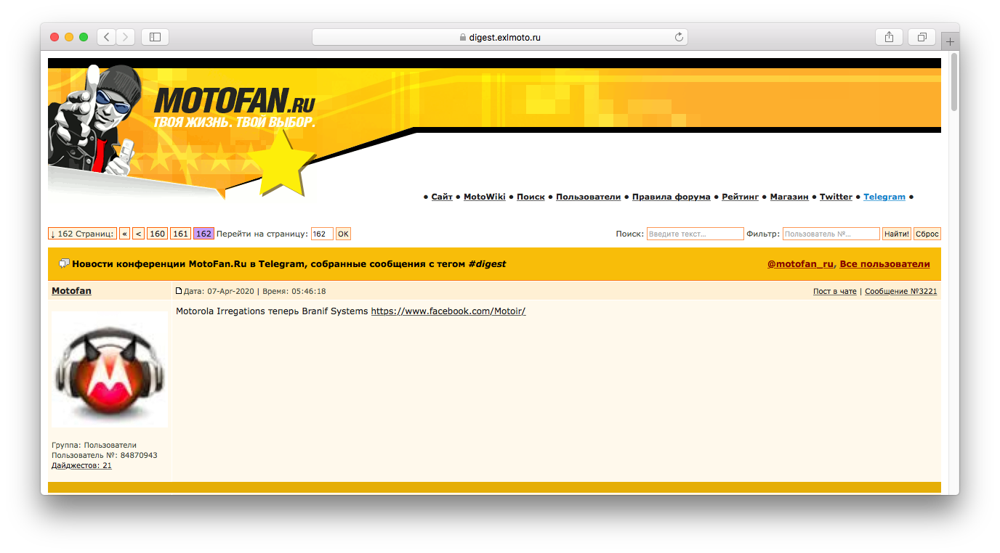
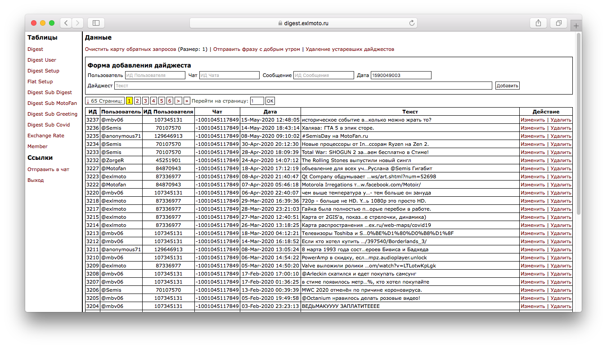

Digest Service
==============

Digest Service is a Telegram bot for group chats combined with website. The main functionality of the service is to collect messages with the **#digest** tag in Telegram chats and display them using the **/digest** command. In addition, the bot has other features e.g. it can subscribe users to various information channels and show various quotes of currencies and precious metals.


The main technologies, libraries and frameworks on which Digest Service is running.

1. [Java/JVM](https://www.oracle.com/java/) language and platform by Oracle Corporation.

2. [Spring Boot](https://spring.io/projects/spring-boot) by Pivotal Software (now VMWare) and its frameworks.

    * [Spring Framework](https://spring.io/projects/spring-framework) for core features and serving web content.
    * [Spring Data JPA](https://spring.io/projects/spring-data-jpa) as a database engine layer.
    * [Spring Security](https://spring.io/projects/spring-security) for authorization purposes.
    * [Thymeleaf](https://www.thymeleaf.org/) as an HTML template engine.

3. [Java Telegram Bot API](https://github.com/pengrad/java-telegram-bot-api) library by [@pengrad](https://github.com/pengrad) for Telegram bot implementation.



The Digest Service website allows you to see all the digests left by users in the main Telegram chat. In addition, the website has a search through digests, some statistics and special APIs. An example of a website ["MotoFan.Ru news in Telegram group!"](https://digest.exlmoto.ru/) that is launched using the Digest Service.



A special control module allows administrators to manage the Digest Service e.g. delete or fix digests, send messages on behalf of the Telegram bot, change some settings etc.

## Requirements

1. [Java Runtime Environment 8+](https://www.oracle.com/java/technologies/javase-jre8-downloads.html) for running or [Java Development Kit 8+](https://www.oracle.com/java/technologies/javase/javase-jdk8-downloads.html) for building (tested with JRE 8).
2. [PostgreSQL](https://www.postgresql.org/) database.
3. [Nginx](https://www.nginx.com/) web server.

## Build & Test & Run

For example, on Linux:

1. Install JDK 8+ via your package manager.

2. Clone source code of the Digest Service via Git:

    ```shell script
    cd ~/Deploy/
    git clone https://github.com/EXL/DigestService DigestService
    ```

3. Build standalone JAR package via Gradle:

    ```shell script
    cd ~/Deploy/DigestService
    ./gradlew clean
    ./gradlew bootJar
    ```

4. Build standalone JAR package with running all tests (optional, database installation required):

    ```shell script
    cd ~/Deploy/DigestService
    ./gradlew clean
    DB_CONNECTION=jdbc:postgresql://localhost:5432/<database name> DB_USERNAME=<username> DB_PASSWORD=<password> HOST=//localhost:8080/ TG_TOKEN=<token> TG_CHAT=<chat id> PROTECT=false ./gradlew build
    ```

5. Run the Digest Service application (optional, database installation required):

    ```shell script
    cd ~/Deploy/DigestService
    DB_CONNECTION=jdbc:postgresql://localhost:5432/<database name> DB_USERNAME=<username> DB_PASSWORD=<password> HOST=//localhost:8080/ TG_TOKEN=<token> TG_CHAT=<chat id> PROTECT=false java -jar build/libs/digest-service-<version>.jar
    ```

## Deploy

For example, on clean [CentOS 7](https://wiki.centos.org/Download) Linux distribution:

## Additional Information

1. [Digest Bot](https://github.com/EXL/DigestBot) is an old JavaScript implementation of similar Telegram bot.
2. Please see [Settings.md](doc/Settings.md) document for information about various Digest Service properties.
3. Please read ["Creating Digest Service" (in Russian)](https://exlmoto.ru/digest-service) article for more information about creating Digest Service project.
