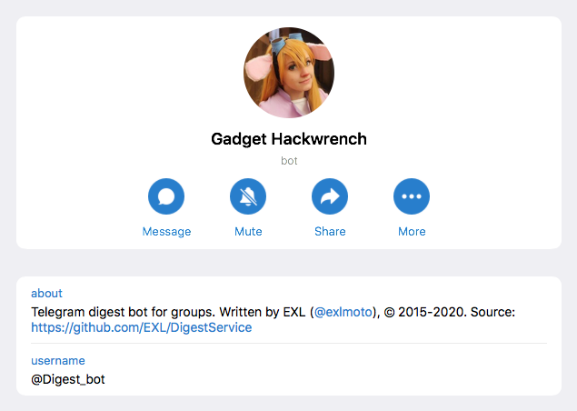
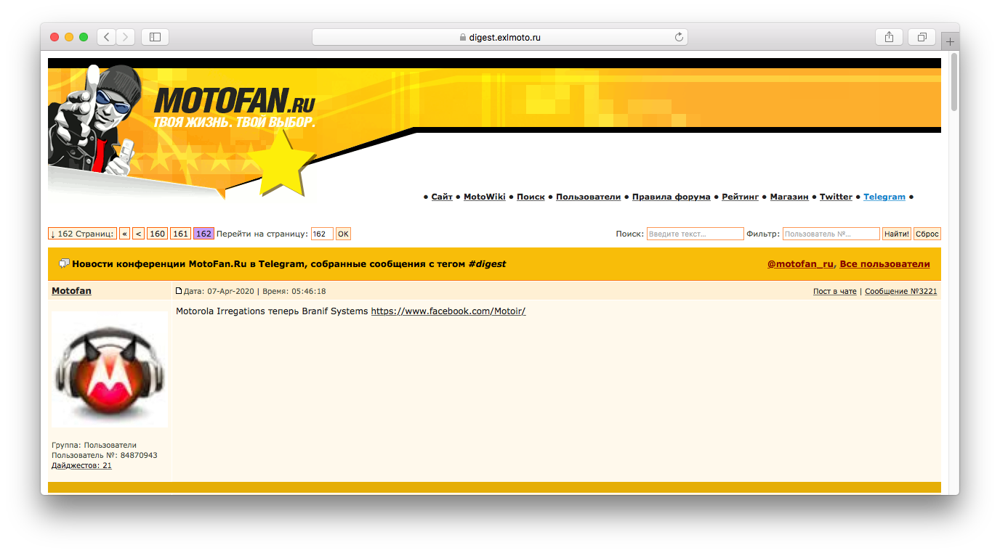
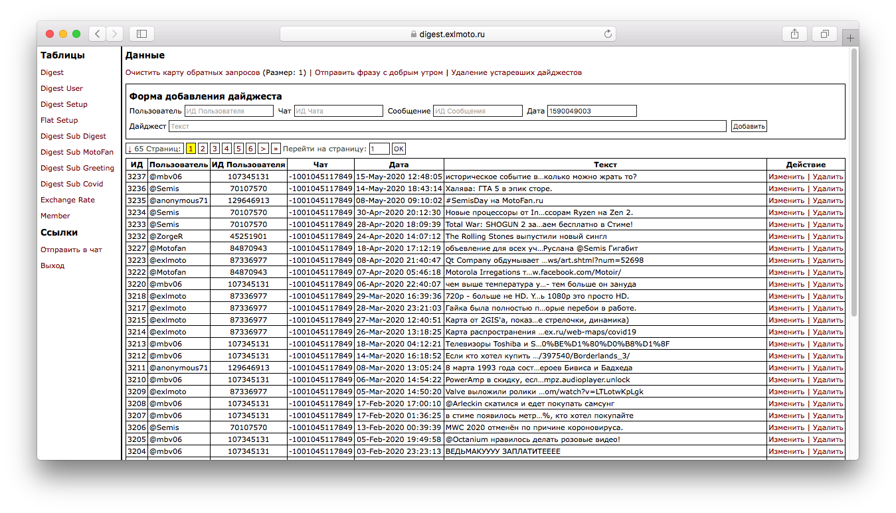

Digest Service
==============

Digest Service is a Telegram bot for group chats combined with website. The main functionality of the service is to collect messages with the **#digest** tag in Telegram chats and display them using the **/digest** command. In addition, the bot has other features e.g. it can subscribe users to various information channels and show quotes of currencies and precious metals.



The main technologies, libraries, and frameworks on which Digest Service was created:

1. [Java/JVM](https://www.oracle.com/java/) language and platform by Oracle Corporation.

2. [PostgreSQL](https://www.postgresql.org/) a powerful, open source object-relational database system.

3. [Spring Boot](https://spring.io/projects/spring-boot) by Pivotal Software (now VMware and then Broadcom) and its frameworks.

4. [Java Telegram Bot API](https://github.com/pengrad/java-telegram-bot-api) library by [@pengrad](https://github.com/pengrad) for Telegram bot implementation.



The Digest Service website allows you to see all the digests left by users in the main Telegram chat. In addition, the website has a search through digests, some statistics and special APIs. An example of the ["MotoFan.Ru news in Telegram group!"](https://digest.exlmoto.ru/) website that was launched using the Digest Service.



A special control module allows administrators to manage the Digest Service, delete or fix digests, send messages on behalf of the Telegram bot, change some settings, etc.

## Requirements

1. [Java Development Kit 25+](https://www.oracle.com/java/technologies/downloads/) for running and building application (tested with OpenJDK 25).
2. [PostgreSQL 18+](https://www.postgresql.org/) database.
3. [Nginx](https://www.nginx.com/) web server (optional).

## Deploy

For example, on a fresh and clean [Ubuntu 26.04 LTS](https://ubuntu.com/) Linux distribution:

1. Prepare environment:

    ```shell script
    sudo timedatectl set-timezone "Europe/Moscow"

    sudo apt update
    sudo apt install -y openjdk-25-jdk postgresql
    ```

2. Setup PostgreSQL database engine:

    ```shell script
    # Create database, user, and grant permissions.
    sudo -u postgres psql -c "CREATE USER digest_user WITH PASSWORD 'digest_password';"
    sudo -u postgres psql -c "CREATE DATABASE digest_database OWNER digest_user;"
    sudo -u postgres psql -d digest_database -c "GRANT ALL ON SCHEMA public TO digest_user;"

    # (Optional) If restoring from a database dump:
    sudo -u postgres pg_restore -d digest_database --no-owner --role=digest_user -v digest.dump
    sudo -u postgres vacuumdb --dbname=digest_database --analyze-in-stages
    sudo -u postgres reindexdb --dbname=digest_database
    ```

    *Note: You may need to change the `max_connections` variable in the `/etc/postgresql/*/main/postgresql.conf` file to 300-500 then restart the PostgreSQL service (`sudo systemctl restart postgresql`).*

3. Test application running:

    ```shell script
    DB_USERNAME=user DB_PASSWORD=password HOST=//digest.exlmoto.ru/ TG_TOKEN=<token> TG_CHAT=<chat id> GH_TOKEN=<token> PROTECT=false java -jar /srv/digest-service-current.jar
    ```

4. Daemonize Digest Service application via [systemd](https://github.com/systemd/systemd) Service Manager:

    ```shell script
    sudo cp util/digest.service /etc/systemd/system/

    # Edit environment overrides
    sudo systemctl edit digest
    ```

    In the opened editor, add your environment variables:

    ```ini
    [Service]
    Environment="HOST=//digest.exlmoto.ru/"
    Environment="TG_TOKEN=<token>"
    Environment="TG_CHAT=<chat id>"
    Environment="DB_USERNAME=digest_user"
    Environment="DB_PASSWORD=digest_password"
    Environment="GH_TOKEN=<token>"
    Environment="PROTECT=false"
    ```

    Secure the override file containing sensitive tokens:

    ```shell script
    sudo chmod 0600 /etc/systemd/system/digest.service.d/override.conf

    sudo systemctl enable --now digest

    sudo journalctl -u digest -f
    ```

5. Add administrator profiles (optional) and finish deployment:

    Go to the **/obey/** page with "*password*" password and any username to enter control module. Then add some administrator profiles to the **Member** database table and restart Digest Service with `PROTECT=true` environment variable:

    ```shell script
    sudo systemctl edit digest

    [Service]
    ...
    Environment=PROTECT=true

    sudo chmod 0600 /etc/systemd/system/digest.service.d/override.conf

    sudo systemctl restart digest
    ```

    Now you can sign in to the control module only with an administrator profiles information.

    *Note:* You can use the ID of your main Telegram chat as a parameter for `TG_CHAT` property and your host url for `HOST` property instead of "digest.exlmoto.ru" address. Please use the **/subscribe** command to get ID of the Telegram chat.

6. Nginx configuration is simple and something like this:

    ```nginx
    server {
        listen 80;
        server_name digest.exlmoto.ru;

        location / {
            proxy_pass http://127.0.0.1:8080;

            proxy_set_header Host $http_host;
            proxy_set_header X-Real-IP $remote_addr;
            proxy_set_header X-Forwarded-For $proxy_add_x_forwarded_for;
            proxy_set_header X-Forwarded-Proto $scheme;
        }
    ```

7. Restart the server after completing the Digest Service configuration and deployment.

## Additional Information

- The [Digest Bot](https://github.com/EXL/DigestBot) project is old JavaScript implementation of the similar Telegram bot.
