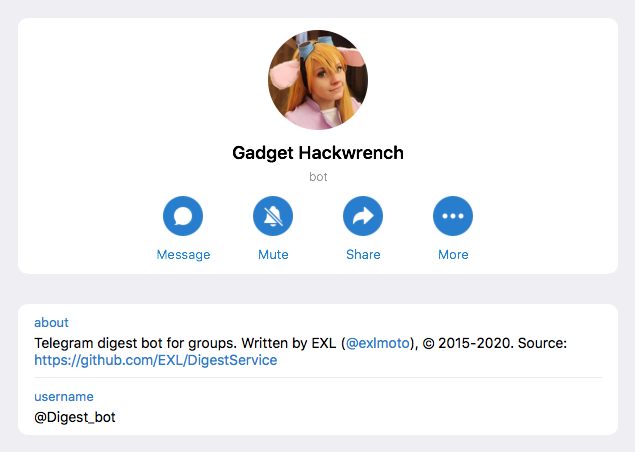
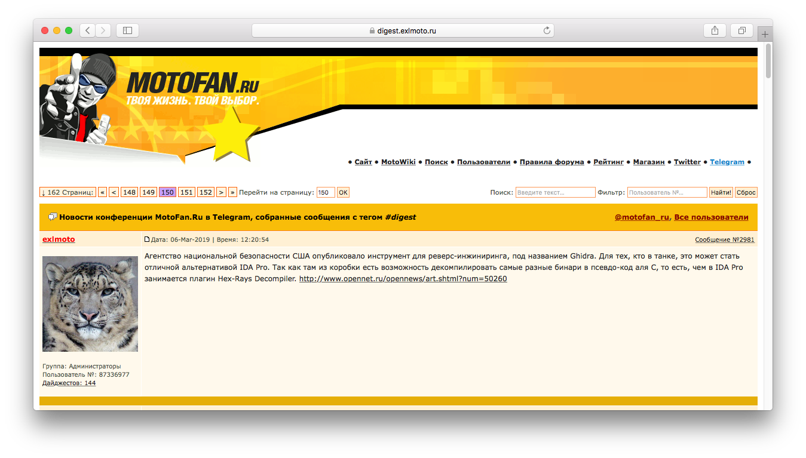

Digest Service
==============

Digest Service is a Telegram bot for group chats combined with website. The main functionality of the service is to collect messages with the **#digest** tag in Telegram chats and display them using the **/digest** command. In addition, the bot has other features e.g. it can subscribe users to various information channels and show quotes of currencies and precious metals.



The main technologies, libraries, and frameworks on which Digest Service was created:

1. [Java/JVM](https://www.oracle.com/java/) language and platform by Oracle Corporation.

2. [Spring Boot](https://spring.io/projects/spring-boot) by Pivotal Software (now VMWare) and its frameworks.

    * [Spring Framework](https://spring.io/projects/spring-framework) for core features and serving web content.
    * [Spring Data JPA](https://spring.io/projects/spring-data-jpa) as a database engine layer.
    * [Spring Security](https://spring.io/projects/spring-security) for authorization purposes.
    * [Thymeleaf](https://www.thymeleaf.org/) as an HTML template engine.

3. [Java Telegram Bot API](https://github.com/pengrad/java-telegram-bot-api) library by [@pengrad](https://github.com/pengrad) for Telegram bot implementation.



The Digest Service website allows you to see all the digests left by users in the main Telegram chat. In addition, the website has a search through digests, some statistics and special APIs. An example of the ["MotoFan.Ru news in Telegram group!"](https://digest.exlmoto.ru/) website that was launched using the Digest Service.


A special control module allows administrators to manage the Digest Service, delete or fix digests, send messages on behalf of the Telegram bot, change some settings, etc.

## Requirements

1. [Java Runtime Environment 8+](https://www.oracle.com/java/technologies/javase-jre8-downloads.html) for running or [Java Development Kit 8+](https://www.oracle.com/java/technologies/javase/javase-jdk8-downloads.html) for building application (tested with JRE/JDK 8).
2. [PostgreSQL](https://www.postgresql.org/) database.
3. [Nginx](https://www.nginx.com/) web server (optional).

## Build & Test & Run

For example, on Linux:

1. Install JDK 8+ via your system package manager.

2. Clone the Digest Service source code via Git:

    ```shell script
    cd ~/Deploy/
    git clone <this repository url> DigestService
    ```

3. Build standalone JAR package via [Gradle Build Tool](https://gradle.org/) wrapper:

    ```shell script
    cd ~/Deploy/DigestService
    ./gradlew clean
    ./gradlew bootJar
    ```

4. Build standalone JAR package and run all tests (optional, database installation required):

    ```shell script
    cd ~/Deploy/DigestService
    ./gradlew clean
    DB_CONNECTION=jdbc:postgresql://localhost:5432/<database name> DB_USERNAME=<username> DB_PASSWORD=<password> HOST=//localhost:8080/ TG_TOKEN=<token> TG_CHAT=<chat id> PROTECT=false ./gradlew build
    ```

5. Run the Digest Service application (optional, database installation required):

    ```shell script
    cd ~/Deploy/DigestService
    DB_CONNECTION=jdbc:postgresql://localhost:5432/<database name> DB_USERNAME=<username> DB_PASSWORD=<password> HOST=//localhost:8080/ TG_TOKEN=<token> TG_CHAT=<chat id> PROTECT=false java -jar build/libs/digest-service-<version>.jar
    ```

## Deploy

For example, on fresh and clean [CentOS 7](https://wiki.centos.org/Download) Linux distribution:

1. Enable [EPEL repository](https://fedoraproject.org/wiki/EPEL) for CentOS 7:

    ```shell script
    sudo yum -y install epel-release
    ```

2. Install necessary and optional packages, apply settings, and update system:

    ```shell script
    sudo su

    passwd root # Set root superuser password.

    yum -y upgrade
    yum -y install vim git logrotate openssh deltarpm yum-utils p7zip p7zip-plugins

    timedatectl set-timezone "Europe/Moscow"

    exit

    cd ~/
    git clone <this repository url> DigestService
    ```

3. Install and create PostgreSQL database:

    ```shell script
    sudo yum -y install postgresql-server postgresql-contrib

    sudo postgresql-setup initdb # CentOS 8 command: postgresql-setup --initdb --unit postgresql

    sudo systemctl start postgresql
    sudo systemctl enable postgresql

    sudo -i -u postgres

    vim data/pg_hba.conf # Replace "ident" to "md5".

    createdb digest
    createuser --interactive # user, n, n, n.

    psql
    ALTER USER user WITH PASSWORD 'password';
    \q

    pg_dump digest > /tmp/digest-service.sql # Optional. BackUp database.
    psql digest < /tmp/digest-service.sql # Optional. Restore database.

    exit

    sudo systemctl restart postgresql
    ```

4. Install Java Runtime Environment and test application running:

    ```shell script
    sudo yum -y install java-1.8.0-openjdk # Or just "java" package.

    scp ~/Deploy/DigestService/build/libs/digest-service-<version>.jar <username>@<host-address>:/home/<username> # Run this command on build host.
    sudo mv ~/digest-service-<version>.jar /srv/

    DB_CONNECTION=jdbc:postgresql://localhost:5432/digest DB_USERNAME=user DB_PASSWORD=password HOST=//digest.exlmoto.ru/ TG_TOKEN=<token> TG_CHAT=<chat id> PROTECT=false java -jar /srv/digest-service-<version>.jar
    ```

5. Daemonize Digest Service application via [systemd](https://github.com/systemd/systemd) Service Manager:

    ```shell script
    cd ~/DigestService/
    sudo cp util/digest.service /etc/systemd/system

    sudo EDITOR=vim systemctl edit digest

    [Service]
    Environment=HOST=//digest.exlmoto.ru/
    Environment=TG_TOKEN=<token>
    Environment=TG_CHAT=<chat id>
    Environment=DB_CONNECTION=jdbc:postgresql://localhost:5432/digest
    Environment=DB_USERNAME=user
    Environment=DB_PASSWORD=password
    Environment=PROTECT=false

    cat /etc/systemd/system/digest.service.d/override.conf
    sudo chmod 0600 /etc/systemd/system/digest.service.d/override.conf
    cat /etc/systemd/system/digest.service.d/override.conf

    sudo systemctl enable digest
    sudo systemctl start digest

    sudo systemctl stop digest # Stop Digest Service application.
    journalctl -u digest # Show Digest Service logs.
    journalctl -fu digest # Show Digest Service logs dynamically.
    ```

6. Install Nginx server and Certbot (optional):

    ```shell script
    sudo firewall-cmd --zone=public --permanent --add-service=http
    sudo firewall-cmd --zone=public --permanent --add-service=https
    sudo firewall-cmd --reload

    sudo yum -y install nginx certbot python2-certbot-nginx

    sudo setsebool -P httpd_can_network_connect 1

    sudo reboot

    sudo systemctl start nginx

    sudo certbot certonly --nginx
    echo "0 0,12 * * * root python -c 'import random; import time; time.sleep(random.random() * 3600)' && certbot renew -q" | sudo tee -a /etc/crontab > /dev/null

    cd ~/DigestService/
    sudo cp util/nginx/digest.conf /etc/nginx/conf.d/
    sudo vim /etc/nginx/conf.d/digest.conf # Change "digest.exlmoto.ru" address to yours e.g. ":%s/digest\.exlmoto\.ru/test\.exlmoto\.ru/g".

    sudo systemctl restart nginx
    sudo systemctl enable nginx
    ```

7. Add administrator profiles (optional) and finish deployment:

    Go to the **/obey/** page with "*password*" password and any username to enter control module. Then add some administrator profiles to the **Member** database table and restart Digest Service with `PROTECT=true` environment variable:

    ```shell script
    sudo EDITOR=vim systemctl edit digest

    [Service]
    ...
    Environment=PROTECT=true

    cat /etc/systemd/system/digest.service.d/override.conf
    sudo chmod 0600 /etc/systemd/system/digest.service.d/override.conf
    cat /etc/systemd/system/digest.service.d/override.conf

    sudo systemctl restart digest
    ```

    Now you can sign in to the control module only with an administrator profiles information.

    *Note:* You can use the ID of your main Telegram chat as a parameter for `TG_CHAT` property and your host url for `HOST` property instead of "digest.exlmoto.ru" address. Please use the **/subscribe** command to get ID of the Telegram chat.

8. Restart the server after completing the Digest Service configuration and deployment.

## Configuration Files

1. [application.properties](src/main/resources/application.properties) is main configuration file for the Digest Service application. Please see [Settings.md](doc/Settings.md) document for descriptions of various Digest Service properties.
2. [digest.service](util/digest.service) is systemd unit file for the Digest Service application.
3. [digest.conf](util/nginx/digest.conf) is Nginx web server config file for the Digest Service website.

## Additional Information

1. The [Digest Bot](https://github.com/EXL/DigestBot) project is old JavaScript implementation of the similar Telegram bot.
2. Please read ["Digest Service and Telegram Bot Commands Cheat Sheet" (in Russian and English)](https://digest.exlmoto.ru/help) manual for more information about Telegram bot commands and Digest Service features.
3. Please read ["Creating Digest Service" (in Russian)](https://exlmoto.ru/digest-service) article for more information about creating the Digest Service project.
