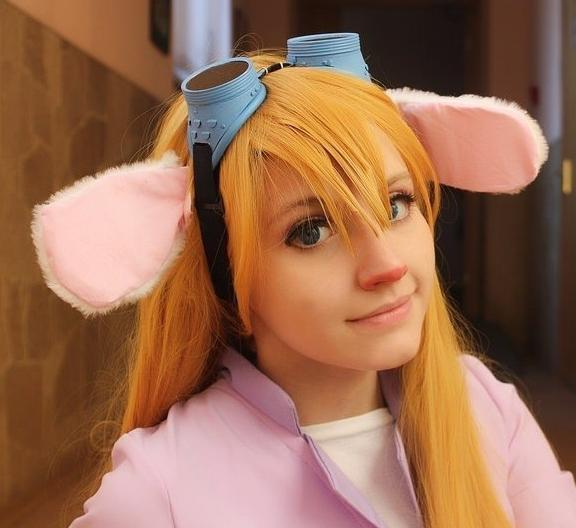

About Avatar
============

The cosplay work of the Gadget Hackwrench character from the [Chip 'n Dale: Rescue Rangers](https://en.wikipedia.org/wiki/Chip_'n_Dale:_Rescue_Rangers) animated series is used as an avatar for the Telegram bot. The original photo is in the [Gadget Hackwrench](https://www.deviantart.com/haruhi-tyan/gallery/47608869/gadget-hackwrench) gallery on DeviantArt. 

DeviantArt ([@Haruhi-tyan](https://www.deviantart.com/haruhi-tyan)) and Instagram ([@maddyharu](https://www.instagram.com/maddyharu/)) profiles of the cosplayer.

Copyright © 2011-2020, Анастасия Эрлих.
